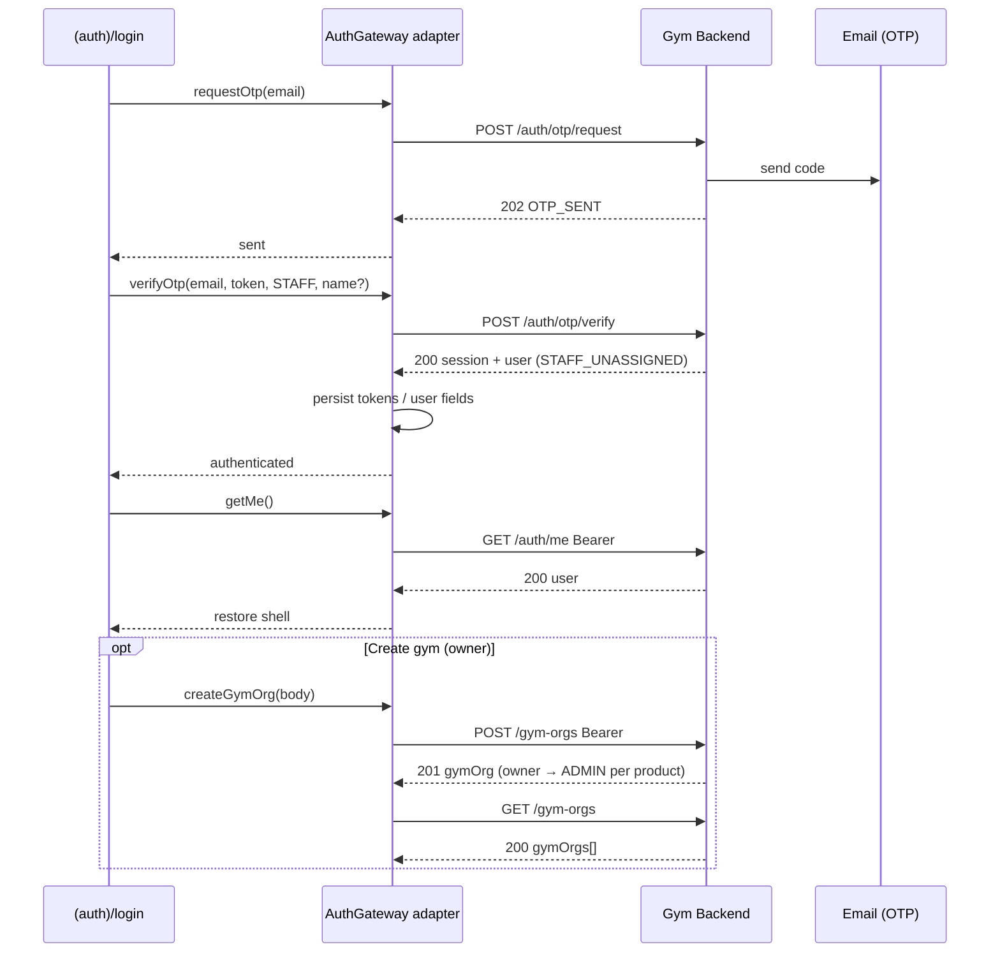

# Research: Gym Backend client auth for Admin web (gym-saas-web)

**Date:** 2026-08-04  
**Question:** How does email OTP / Google / session / gym-orgs auth work for **gym-saas-web** (Admin-first Next.js, STAFF lane)?  
**Method:** Primary sources only (backend integration guide, vendored Postman, architecture/product docs, verify skill). Secondary blogs not used. Upstream Postman README used only as collection corroboration.

---

## 1. Executive summary

- Gym SaaS web (S2) is an HTTP client of Gym Backend (S3). Auth identity and provisioning live on the API; this repo stores session and calls Bearer-protected routes. [[architecture-plan.md §1](../architecture-plan.md)], [[client-auth.md](../api/client-auth.md)]
- There is **no separate sign-up**. First successful `POST /auth/otp/verify` or `POST /auth/google/complete` **provisions** the app user; later logins return the same user. [[client-auth.md](../api/client-auth.md)], [Postman collection Auth folder]
- **Admin web hard-codes `lane: "STAFF"`** on verify/complete (no CLIENT chooser on Admin login). First STAFF provision yields `roleCode: STAFF_UNASSIGNED` and a non-null `staffCode`. [[client-auth.md](../api/client-auth.md)], [[product-flows.md F1.2](../product-flows.md)], [Postman Verify OTP STAFF example]
- Canonical Admin path: email → `POST /auth/otp/request` → paste full OTP → `POST /auth/otp/verify` with STAFF → persist `accessToken` (+ `refreshToken`, `expiresIn` for OTP) → `GET /auth/me` → `POST|GET /gym-orgs`. [[client-auth.md](../api/client-auth.md)], [[verify-api-flow](../../.cursor/skills/verify-api-flow/SKILL.md)]
- Errors always use `{ "error": { "code", "message" } }` with no field-level details. Branch UI on `code`; show `message` as fallback. [[client-auth.md](../api/client-auth.md)], [Postman collection description]
- Google is **optional / secondary**: start → callback hash `access_token` → complete with Bearer identity; tokens are **not** rotated (keep Google session token). Product treats email OTP as canonical. [[client-auth.md](../api/client-auth.md)], [[PRD.md §7.1](../PRD.md)], [[architecture-plan.md §3](../architecture-plan.md)]
- Clean Architecture: `(auth)` UI renders; use-cases depend on `AuthGateway` / `GymOrgWriter` ports; `lib/api/*` adapters own HTTP + schema; `lib/auth` owns session persistence (A2 still open: httpOnly cookie vs memory). [[architecture-plan.md §4–5, §7, §9, A2](../architecture-plan.md)]
- Creating a gym requires Bearer + `roleCode` in `{ STAFF_UNASSIGNED, ADMIN }`; empty `GET /gym-orgs` → `{ "gymOrgs": [] }` is success, not an error. [[client-auth.md](../api/client-auth.md)], [Postman Gym Orgs]

---

## 2. Source inventory

| Source | Path / URL | Owns |
|--------|------------|------|
| Backend integration guide (WhatsApp, product-owned) | WhatsApp `client-auth.md` (synced into repo 2026-08-04) | Endpoint shapes, error codes, UX checklist, prod base URL |
| Repo auth guide (working copy) | `docs/api/client-auth.md` | Same as above + Admin STAFF hard-code + vendored Postman pointers |
| Vendored Postman collection | `postman/Gym-Backend-API.postman_collection.json` | Request bodies, Examples, error catalogs, auth model tiers, test scripts that store tokens |
| Postman environments | `postman/Gym-Backend-Dev.postman_environment.json`, `Gym-Backend-Local.postman_environment.json` | Variable keys: `baseUrl`, `email`, `lane`, `otpToken`, tokens, `userId`, `expiresIn` (collection also has `gymOrgId`) |
| Upstream Postman README | https://github.com/abdulhasibn/gym-backend-postman | Corroborates smoke flow and file layout (not sole API truth) |
| Architecture plan | `docs/architecture-plan.md` | Ports/adapters, `(auth)` routes, session A2, Admin shell rules |
| Architecture summary | `docs/architecture.md` | S2 surface, Admin-first phases |
| Domain glossary | `docs/CONTEXT.md` | Lane, Role, Admin, GymOrg names |
| PRD | `docs/PRD.md` | A1/T1 auth product rules; email OTP primary; Google secondary; no Facebook |
| Product flows | `docs/product-flows.md` | F1.1–F1.3 auth journeys; M2 create gym |
| Verify skill | `.cursor/skills/verify-api-flow/SKILL.md` | Agent smoke: STAFF OTP → `/auth/me` → `/gym-orgs` |
| Prod API base | `https://gym-backend-lovat-mu.vercel.app` | From integration guide / verify skill |

---

## 3. Diff: WhatsApp guide vs prior `docs/api/client-auth.md`

Compared WhatsApp copies (identical) under macOS WhatsApp documents to the pre-sync repo file. **WhatsApp was richer on API facts; repo had Admin-local annotations.** Nothing in WhatsApp contradicted Postman Examples/descriptions.

| Topic | Prior repo guide | WhatsApp / Postman (sync target) | Action taken 2026-08-04 |
|-------|------------------|----------------------------------|-------------------------|
| OTP verify **200** body | One-line shape summary | Full JSON example (`session` + `user`) | Synced into `docs/api/client-auth.md` |
| `OTP_EXPIRED` meaning | “request a new code” only | Wrong **or** expired (GoTrue one code); partial paste fails same | Synced |
| Verify errors | Mostly `LANE_MISMATCH` emphasized | Also `EMAIL_NOT_VERIFIED`, `VALIDATION_ERROR`, `AUTH_RATE_LIMITED` | Synced |
| Google complete | Flow bullets only | Error codes: `AUTHENTICATION_FAILED`, `GOOGLE_IDENTITY_REQUIRED`, `EMAIL_NOT_VERIFIED`, `VALIDATION_ERROR`, `LANE_MISMATCH` | Synced |
| Google start | Implied browser open | 302 → Supabase; Postman also documents `503` `OAUTH_CONFIGURATION` | Synced (+ Postman note) |
| `/auth/me` 401 | Code only | Missing/invalid token **or** identity exists but app user not provisioned | Synced |
| Cold start | Implicit | Explicit: call `/auth/me` to restore UI from stored token | Synced |
| `POST /gym-orgs` | Prose field list | Full JSON body + **201** / **403** `GYM_ORG_CREATION_FORBIDDEN` | Synced (+ Postman 401/422) |
| `GET /gym-orgs` | List shape | Explicit empty `[]` is OK | Synced |
| Admin STAFF hard-code | Present in repo | WhatsApp says apps “may hard-code” lane | **Kept** Admin-specific wording in repo guide |
| Related / vendored paths | Present in repo | Absent in WhatsApp | **Kept** Related section + research link |
| Lane on OTP request | Repo silent | Postman: lane **not** accepted on request | Synced |

**Not overwritten blindly:** Admin STAFF hard-code and Related links preserved because they are repo-local and still accurate. [[verify-api-flow](../../.cursor/skills/verify-api-flow/SKILL.md)], [[architecture-plan.md §7](../architecture-plan.md)]

---

## 4. End-to-end Admin flow (STAFF)

### Numbered steps

1. **Login UI** (`app/(auth)/login`) collects email (+ optional name). Lane is fixed `STAFF` for Admin web. [[architecture-plan.md §5–7](../architecture-plan.md)], [[client-auth.md](../api/client-auth.md)]
2. **Request OTP** — `POST {baseUrl}/auth/otp/request` body `{ "email" }` → `202` `{ "status": "OTP_SENT" }`. [[client-auth.md](../api/client-auth.md)], [Postman Request OTP]
3. User pastes **full** emailed code (currently 6 digits). Re-request invalidates prior code. [[client-auth.md](../api/client-auth.md)]
4. **Verify OTP** — `POST /auth/otp/verify` `{ email, token, lane: "STAFF", name? }` → `200` `{ session, user }`. First time: `roleCode: "STAFF_UNASSIGNED"`, `staffCode` string. [[client-auth.md](../api/client-auth.md)], [Postman STAFF example]
5. **Persist session** — store at least `accessToken`; for OTP also `refreshToken`, `expiresIn`, plus `userId`, `lane`, `roleCode` for UI. Storage mechanism is open decision A2. [[client-auth.md](../api/client-auth.md)], [[architecture-plan.md A2](../architecture-plan.md)]
6. **Session restore / guard** — `GET /auth/me` with `Authorization: Bearer <accessToken>` → current `user`. [[client-auth.md](../api/client-auth.md)], [Postman Get Current User]
7. **Gym onboarding (owner path)** — if `STAFF_UNASSIGNED` (or later `ADMIN`), `POST /gym-orgs` with name/contact/timezone → `201` `{ gymOrg }`; then `GET /gym-orgs` for affiliations (may be empty before create). [[client-auth.md](../api/client-auth.md)], [[PRD.md journey](../PRD.md)], [[product-flows.md M2](../product-flows.md)]
8. **Admin shell** — plan requires `ADMIN` role + gym affiliation for `(admin)/*`; MVP UI uses a single active `gym_org_id` (no branch switcher). [[architecture-plan.md §7](../architecture-plan.md)], [[CONTEXT.md GymOrg](../CONTEXT.md)]

### Sequence (OTP)

**Google alternate (optional):** `GET /auth/google/start` → browser consent → capture `access_token` from hash → `POST /auth/google/complete` Bearer + `{ lane: "STAFF", name? }` → `{ user }` only (keep Google access token; no refresh from this endpoint). [[client-auth.md](../api/client-auth.md)], [Postman Google]

**Auth model tiers (Postman):** public (`/health`, OTP, google/start) → Bearer **identity** (`google/complete`) → Bearer **provisioned** (`/auth/me`, `/gym-orgs`). [Postman collection description]

---

## 5. Mapping to Clean Architecture ports/adapters

| Concern | Belongs in | Why |
|---------|------------|-----|
| OTP request/verify, Google start/complete, getMe | Port `AuthGateway` in `lib/ports/auth.ts`; adapter `lib/api/auth-adapter.ts` | UI must not own URLs or `fetch`. [[architecture-plan.md §4, §9](../architecture-plan.md)] |
| Endpoint constants + Zod/schema at boundary | `lib/api/endpoints.ts`, schemas next to adapter | Validate before use-cases. [[architecture-plan.md §9](../architecture-plan.md)] |
| HTTP client: base URL, Bearer header, refresh retry once | `lib/api/client.ts` | Plan locks Bearer + refresh in auth layer. [[architecture-plan.md §3, §9](../architecture-plan.md)] |
| Map `error.code` → calm copy | `lib/api/errors.ts` (+ display helpers if needed) | Never dump raw payloads in UI. [[architecture-plan.md §9](../architecture-plan.md)], [.cursor/rules/error-handling.mdc] |
| Persist/read session (tokens, lane, role) | `lib/auth/session` (adapter implementing a small session port) | Composition root / guards use it; A2 decides cookie vs memory. [[architecture-plan.md §5, A2](../architecture-plan.md)] |
| Create/list gym orgs | Port `GymOrgWriter` / reader; `lib/api` gym-orgs adapter | Separate from auth port (ISP). [[architecture-plan.md §4 I, §9](../architecture-plan.md)] |
| Login screens, staff_code empty state, create-gym wizard chrome | `app/(auth)/*`, later `(admin)/settings` | Presentation only; named handlers. [[architecture-plan.md §5–6](../architecture-plan.md)], [[product-flows.md F1.2, M2](../product-flows.md)] |
| Use-cases e.g. `loginWithOtp`, `restoreSession`, `createGymOrg` | `lib/features/auth/`, `lib/features/gym-org/` | Depend on port types; composition root binds adapters. [[architecture-plan.md §4](../architecture-plan.md)] |

**Do not put in JSX:** entitlement math, dayjs, raw `fetch`, magic URL strings. [[architecture-plan.md §4](../architecture-plan.md)], [.cursor/rules/code-quality.mdc]

---

## 6. Error UX matrix (Admin)

Calm copy suggestions for Admin UI; always prefer branching on `error.code`. Sources: WhatsApp/repo guide + Postman request docs/Examples.

| `error.code` | Typical HTTP | When | Calm copy (suggested) | Next action |
|--------------|--------------|------|------------------------|-------------|
| `VALIDATION_ERROR` | 422 | Bad email / body | “Check the email and try again.” | Fix field; retry |
| `EMAIL_ADDRESS_INVALID` | 422 | Malformed email on request | “That email doesn’t look valid.” | Fix email |
| `AUTH_RATE_LIMITED` | 429 | Too many OTP requests | “Please wait about a minute, then request a new code.” | Wait ~60s; request again [[client-auth.md](../api/client-auth.md)] |
| `OTP_DELIVERY_FAILED` | 502 | Email send failed | “We couldn’t send the code. Try again in a moment.” | Retry request |
| `OTP_EXPIRED` | 422 | Wrong **or** expired **or** partial code | “That code isn’t valid anymore. Request a new one.” | Back to request OTP [[client-auth.md](../api/client-auth.md)] |
| `EMAIL_NOT_VERIFIED` | 422 | Verify/complete path | “Verify your email to continue.” | Follow product email-verify path; do not invent Facebook/phone OTP [[PRD.md §7.1](../PRD.md)] |
| `LANE_MISMATCH` | 409 | Email already on other lane | “This email is already used for a member account. Use a different email for staff, or sign in on the member app.” | New email / correct surface [[CONTEXT.md](../CONTEXT.md)], [[product-flows.md F1.3](../product-flows.md)] |
| `AUTHENTICATION_FAILED` | 401 | Missing/invalid Bearer; or identity without provisioned app user | “Sign in again to continue.” | Clear session → OTP/Google; if Google-only identity, run complete/provision [[client-auth.md](../api/client-auth.md)] |
| `GOOGLE_IDENTITY_REQUIRED` | 422 | Complete without Google identity | “Continue with Google, then finish sign-in.” | Restart Google start |
| `OAUTH_CONFIGURATION` | 503 | Google start misconfigured | “Google sign-in isn’t available right now. Use email code.” | Fall back to OTP [Postman Google start] |
| `GYM_ORG_CREATION_FORBIDDEN` | 403 | Role/lane cannot create org | “This account can’t create a gym. Ask an owner for a staff invite, or use a staff account.” | Staff invite path [[product-flows.md M2](../product-flows.md)] |
| (fallback) | non-2xx | Unknown code | Show API `message` calmly; offer retry | Contact support if persistent |

**Empty ≠ error:** `GET /gym-orgs` → `{ "gymOrgs": [] }` means no affiliations yet — show “Create your gym” / waiting-for-invite empty state. [[client-auth.md](../api/client-auth.md)], [[product-flows.md F1.2](../product-flows.md)]

---

## 7. Explicit out-of-scope / deferred

| Item | Stance | Source |
|------|--------|--------|
| Google on Admin MVP | Product includes Google as secondary P0 for A1/T1/C1; integration guide labels Google **optional**. Engineering may ship OTP-first Admin login and add Google in the same M1 slice or immediately after — do not block OTP. | [[PRD.md A1, C1, §7.1](../PRD.md)], [[client-auth.md](../api/client-auth.md)] |
| CLIENT lane UI in Admin app | Deferred Phase B `(client)/*`; Admin must not offer membership-invite accept on STAFF. | [[architecture-plan.md §7, A4](../architecture-plan.md)], [[product-flows.md F1.3](../product-flows.md)] |
| Refresh token rotation / refresh endpoint | OTP returns `refreshToken` + `expiresIn`; plan says “refresh handled in auth layer” / “retry once”. **No refresh endpoint** in vendored Postman collection — treat rotation details as **undocumented**; confirm with backend before implementing. | [Postman Auth], [[architecture-plan.md §3, §9](../architecture-plan.md)] |
| Facebook / phone OTP | Out of MVP — never offer. | [[PRD.md](../PRD.md)], [[product-flows.md](../product-flows.md)], [.cursor/rules/security-data-grants.mdc] |
| Session storage (httpOnly vs memory) | Open A2; prefer httpOnly via Next route handlers once scaffolded; write ADR when deciding. | [[architecture-plan.md A2](../architecture-plan.md)] |
| Multi-gym switcher | Out of MVP UI even if owner has multiple orgs. | [[CONTEXT.md](../CONTEXT.md)], [[architecture-plan.md §7](../architecture-plan.md)] |
| QR staff invite / custom RBAC | Product later / out of MVP architecture non-goals. | [[architecture-plan.md §13](../architecture-plan.md)] |

---

## 8. Recommended next engineering steps

1. **Smoke the contract** — run `verify-api-flow` against prod or local: STAFF OTP → `/auth/me` → create/list gym orgs; record real payloads (do not invent). [[verify-api-flow](../../.cursor/skills/verify-api-flow/SKILL.md)]
2. **Scaffold Next.js** per plan §5 with `lib/ports`, `lib/api`, `lib/auth`, `(auth)/login`, `(admin)` placeholders. [[architecture-plan.md §5](../architecture-plan.md)], [[PROGRESS.md](../PROGRESS.md)]
3. **Decide A2** (session storage) and draft ADR before shipping M1 to production. [[architecture-plan.md A2](../architecture-plan.md)]
4. **Implement M1 ports** — `AuthGateway` + OTP use-cases + error mapper from §6; hard-code STAFF; staff_code empty state after login. [[architecture-plan.md §6 M1](../architecture-plan.md)]
5. **Implement M2 create gym** behind `GymOrgWriter` after STAFF_UNASSIGNED. [[architecture-plan.md §6 M2](../architecture-plan.md)], [[PRD.md A1](../PRD.md)]
6. **Ask backend** for refresh-token endpoint/OpenAPI (or document “no refresh yet”) before building silent refresh. [Postman gap]
7. Keep `docs/api/client-auth.md` aligned with Postman when Examples change; prefer Examples when generating typed clients. [[client-auth.md](../api/client-auth.md)]

---

## 9. Citations index

Claims in this note are tagged inline. Primary anchors:

1. `docs/api/client-auth.md` — synced 2026-08-04 from WhatsApp guide + Postman corroboration (Admin annotations retained).
2. WhatsApp `client-auth.md` — backend integration guide (fuller OTP/Google/gym-orgs error and body detail).
3. `postman/Gym-Backend-API.postman_collection.json` — Auth + Gym Orgs request descriptions and Examples.
4. `postman/Gym-Backend-*.postman_environment.json` — env variable names.
5. https://github.com/abdulhasibn/gym-backend-postman/README.md — smoke flow corroboration only.
6. `docs/architecture-plan.md` — §§1, 3–7, 9, A2, A4, 13.
7. `docs/architecture.md` — S2 Admin-first surface.
8. `docs/CONTEXT.md` — lane, role, Admin, GymOrg.
9. `docs/PRD.md` — §§3–4 (A1/T1/C1), journey step 1, §7.1 auth.
10. `docs/product-flows.md` — M1 F1.1–F1.3, M2 create gym.
11. `.cursor/skills/verify-api-flow/SKILL.md` — Admin STAFF smoke procedure.
12. Prod base URL `https://gym-backend-lovat-mu.vercel.app` — guide + verify skill.

**Not used as sole source:** secondary blog posts; invented refresh APIs; live OpenAPI (not present in repo — hand types until exported per A3).
